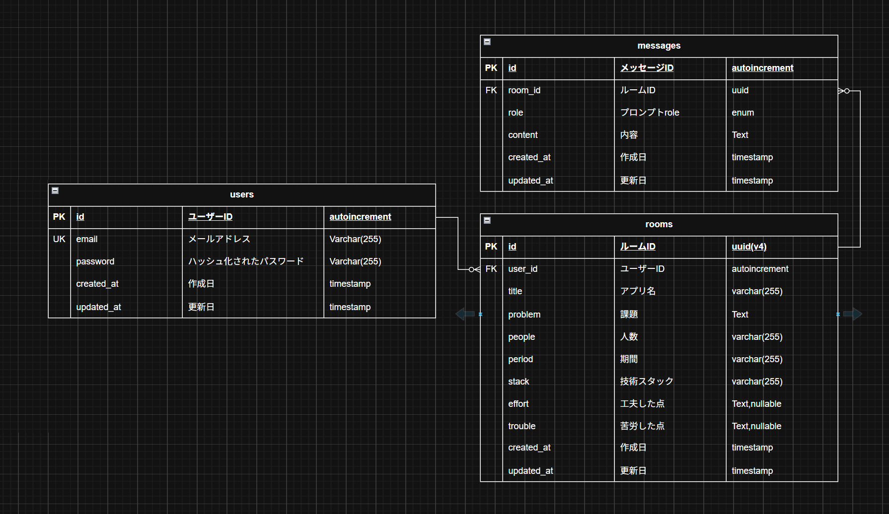

# readme-generator-api
## ER図

## API仕様書
[こちらをクリック(notion)](https://www.notion.so/2ffe8b7611b380968899e2f6462400a3?v=2ffe8b7611b3809fb50d000ca465cd62&source=copy_link)
## 環境構築
```bash
make build
make up
cd src
cp .env.example .env
make in # 失敗したらdocker compose run api bash
# コンテナの中で実行
composer install
php artisan key:generate
```